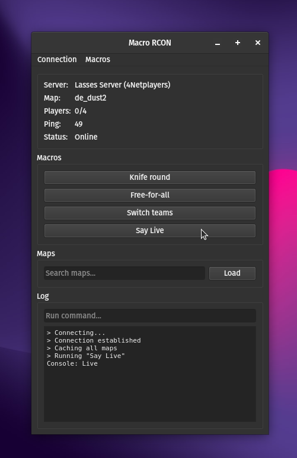
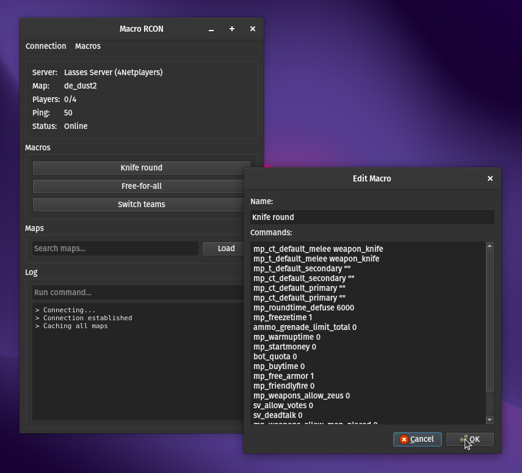

# Macro RCON (Source)

Macro RCON is an application designed for managing Source game servers, such as Counter-Strike: Global Offensive (CSGO) servers. The application provides an basic interface to execute custom macros and commands, view server information, and manage your server efficiently.

## Features

- Create, edit, and delete custom macros to run sets of commands with a single click
- Execute individual commands in the log area
- View server information, such as current map, players count, and ping.
- Autocomplete map names for quick map changes
- Automatically save and load macros and connection settings from a JSON file

## Getting Started

To get started with Macro RCON, follow these steps:

1. Clone the repo.
1. Install the dependencies with `pip install -r requirements.txt` or `pip install PyQt6 python-a2s python-valve`
1. If you're on Ubuntu you might need to run `sudo apt install libxcb-cursor0`
1. Run the application by either double-clicking on the `app.pyw` or from the terminal with `python app.pyw`
2. Configure your server connection settings (hostname, port, and password) when prompted and you're good to go!.

## Contributing

If you would like to contribute to the development of Macro RCON or report any issues, please feel free to open an issue or submit a pull request on the project's GitHub repository.

## License

Macro RCON is released under the [MIT License](LICENSE).
